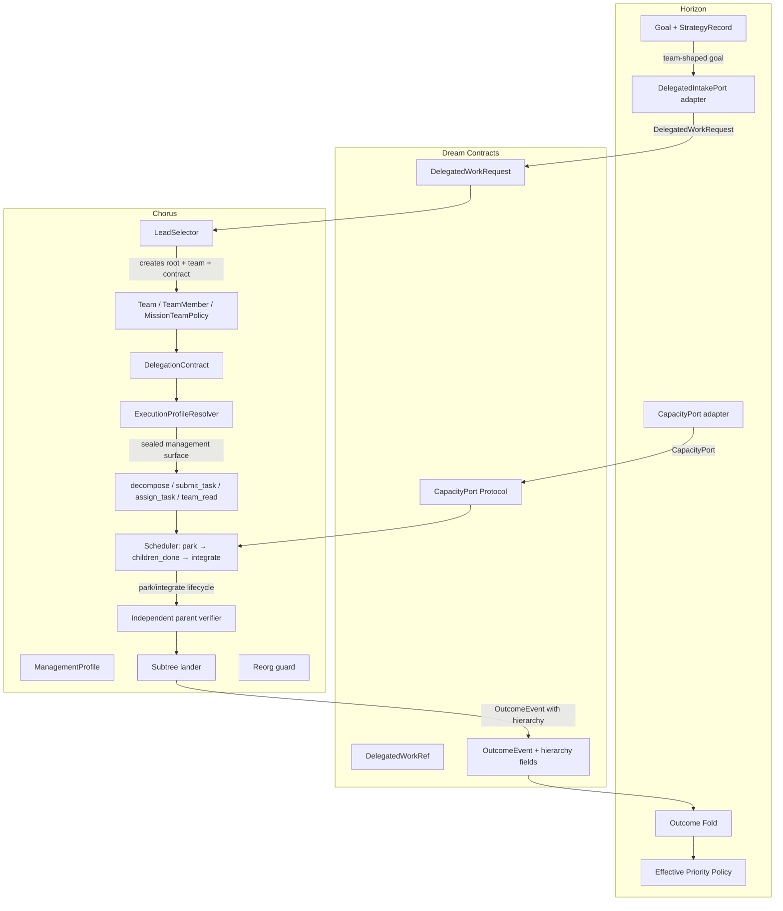

# Introduction

M8 transforms the Chorus operating kernel from a single-Manager role into a composable management authority model. Any specialist employee may hold a management profile and lead delegation-mode tasks while retaining their craft profession. A per-goal mission Team provides durable audit identity, and Horizon gains multi-task goal tracking with capacity-informed effective priority.

The key words "MUST", "MUST NOT", "REQUIRED", "SHALL", "SHALL NOT", "SHOULD", "SHOULD NOT", "RECOMMENDED", "MAY", and "OPTIONAL" in this document are to be interpreted as described in RFC 2119.

**Cross-reference conventions**: This document uses standardized prefixes for traceability — `FR-` (functional requirements), `NFR-` (non-functional requirements), `FM-` (failure modes), `AC-` (acceptance criteria), and `RD-` (resolved decisions).

## 1. Goals and Non-Goals

- **Goal 1**: Decouple management authority from profession so any specialist MAY lead delegation work without changing `Employee.role`.
- **Goal 2**: Introduce explicit `ManagementProfile`, `Team`, `TeamMember`, and `DelegationContract` persistence in Chorus with human-governed mutation boundaries.
- **Goal 3**: Make task execution mode (`delivery` | `delegation`) an explicit, persisted field that drives tool/DoD/lander resolution.
- **Goal 4**: Replace static `role == "manager"` checks with profile-and-contract authorization in the execution profile resolver.
- **Goal 5**: Implement per-goal mission Teams created atomically with delegation roots and archived on contract closure.
- **Goal 6**: Give Horizon the ability to submit team-shaped work via `DelegatedIntakePort` and track multi-task goal outcomes.
- **Goal 7**: Surface capacity-informed effective priority using existing beat/task/budget facts (no second scheduler).
- **Goal 8**: Provide an explicit Manager-to-specialist migration path that preserves identity/history.

### In Scope

- `ManagementProfile` model, repository, migrations, facade APIs, audit events, human-only mutation boundary.
- `ExecutionMode` enum and `execution_mode` column on `Task`.
- `DelegationContract` model with pinned authority and objective rubric.
- `Team`/`TeamMember` durable models implementing mission-team lifetime policy.
- `ExecutionProfileResolver` resolving tools/DoD/lander from task mode + profession + profile.
- Active-contract reorganisation guards (`ActiveDelegationConflict`).
- Lead selection with user override and typed `staffing_blocked` failures.
- `DelegatedWorkRequest`/`DelegatedWorkRef`/`DelegatedIntakePort`/`CapacityPort` contracts in Dream.
- Horizon `delivery_shape`, multi-task strategy record, outcome hierarchy fold, effective priority.
- Manager specialization migration CLI command and diagnostics.
- Deterministic, adversarial, lifecycle, cross-repo, and live capstone tests.

### Out of Scope (deferred)

- Cross-line borrowing, matrix reporting, or org-wide talent marketplace — requires multi-line authority model.
- Standing-team reuse, persistent squad membership — requires cross-goal lifecycle tracking.
- A lead performing craft work inside a delegation-mode parent beat — fundamentally violates coordination-only invariant.
- Horizon naming employees or building task DAGs — strategy MUST NOT schedule.
- Unlimited recursive delegation — existing depth cap remains authoritative.
- Automatic `reports_to` changes by Chorus — requires governance escalation model.

## 2. Terminology

| Term | Definition |
|------|------------|
| Management Profile | A policy row (`ManagementProfile`) granting bounded management authority to a specialist; human-governed, versioned, audited. |
| Execution Mode | An enum (`delivery` \| `delegation`) persisted on `Task` determining whether the task uses the profession contract or the management contract. |
| Delegation Contract | A frozen record (`DelegationContract`) pinning the authority (profile version, limits, rubric) under which a delegation-mode task operates. |
| Mission Team | A durable `Team` entity created for one delegated root goal and archived when that root's contract closes. |
| Lead | The specialist employee who owns a delegation-mode task and is accountable for the integrated result. |
| Execution Profile Resolver | A trusted runtime component that assembles the harness surface (prompt/tools/DoD/lander) from profession + task contract + authorization. |
| Effective Priority | The strategic score adjusted by observed capacity/budget facts; the ordering Horizon publishes for reporting. |
| Active Delegation Conflict | A fail-closed error raised when an org mutation (reports_to change, profile deactivation, termination) would invalidate an in-flight delegation contract. |

## 3. Solution Architecture

**Ownership boundaries:**
- **Dream** (`dream/src/dream/contracts/`): shared cross-repo Protocols and DTOs — `DelegatedWorkRequest`, `DelegatedWorkRef`, `DelegatedIntakePort`, `StaffingRequirement`, `ProfessionCapacity`, `CapacityPort`, and additive `OutcomeEvent` fields.
- **Chorus** (`chorus/src/chorus/`, `chorus/src/chorus_employee/`, `chorus/src/chorus_tools/`, `chorus/src/chorus_harness/`): all people, teams, authority, delegation, capacity, execution resolution, and management tools.
- **Horizon** (`horizon/src/horizon/`): goal strategy, intake routing, multi-task outcome fold, effective priority.

## 4. Requirements

**Summary**: The system MUST decouple management from profession, persist authority and team structures durably, resolve execution contracts at runtime, enforce strict direct-report scoping, and allow Horizon to submit team-shaped work and fold hierarchical outcomes.

**Items**:
- **REQ-001**: `ManagementProfile` MUST be a separate policy row (not a boolean or role attribute) with `can_lead`, `can_subdelegate`, `max_delegation_depth`, `max_team_size`, `allowed_professions`, `spend_limit_cents`, monotonic `version`, and `granted_by_user_id`.
- **REQ-002**: `Task.execution_mode` MUST be a persisted enum column defaulting to `delivery`; delegation mode MUST NOT be inferred from child row existence.
- **REQ-003**: `DelegationContract` MUST pin effective authority (profile version, limits, rubric, status) and the effective authority MUST be the intersection of global policy ∩ profile ∩ reporting scope ∩ team membership ∩ parent contract.
- **REQ-004**: A durable `Team` entity with `lead_employee_id`, `goal_id`, `status` lifecycle (`forming`→`active`→`blocked`→`archived`) MUST be created atomically with the delegation root.
- **REQ-005**: Every M8 child assignee MUST be a direct report of the team's lead; Team MUST NOT widen line authority.
- **REQ-006**: `ExecutionProfileResolver` MUST replace static role-based tool registration and MUST produce a sealed management surface only after authorization verification.
- **REQ-007**: Delivery and delegation execution surfaces MUST NOT coexist in one beat.
- **REQ-008**: Parent completion MUST require: all descendants terminal + lead explicit acceptance + independent objective verification.
- **REQ-009**: Integrate-loop exhaustion MUST escalate (open recovery); it MUST NOT force-accept.
- **REQ-010**: Active delegation contracts MUST block org mutations (reports_to, profile, termination) affecting their participants (`ActiveDelegationConflict`).
- **REQ-011**: `DelegatedIntakePort` MUST accept `DelegatedWorkRequest` (intent, goal_id, priority, staffing requirements, preferred_lead) and return `DelegatedWorkRef` or a typed `staffing_blocked` failure.
- **REQ-012**: Horizon MUST track `root_task_id`, `task_ids`, `team_id`, `lead_id`, per-task outcomes; the root subtree outcome MUST be authoritative for goal completion.
- **REQ-013**: Effective priority MUST be derived from raw score + capacity/budget snapshot and MUST surface a reason string.
- **REQ-014**: Manager specialization migration MUST explicitly choose a profession and create a profile; no silent conversion.
- **SEC-001**: Management tools MUST be absent from harnesses where authorization is not met; the service layer MUST independently reject forged/stale calls.
- **CON-001**: No sibling imports — Dream owns shared contracts; Chorus MUST NOT import Horizon; Horizon MUST NOT import Chorus.
- **CON-002**: Existing `IntakePort`, beat serialization, budget gates, and worktree isolation MUST remain unchanged.
- **CON-003**: All fan-out and retry operations MUST be exact-once via deterministic IDs and idempotent claims.
- **NFR-001**: All new persistence MUST use applied-migration-set schema versioning (existing `chorus.ledger.migrations` pattern).
- **NFR-002**: Every mutation MUST emit an auditable `Activity` with a typed `ActivityVerb`.

### Failure Modes

| ID | Failure | Required Behavior | Traces To |
|----|---------|-------------------|-----------|
| FM-001 | Authority intersection silently widens a nested lead's scope | Intersection MUST never exceed any individual input layer; property tests MUST enforce this. | REQ-003, AC-011 |
| FM-002 | Delivery task invokes management tools (tool surface leak) | Management tools MUST be absent from the harness; service layer MUST independently reject forged calls. | SEC-001, AC-001 |
| FM-003 | Delegation task assigned to unprofiled employee | Intake/assignment MUST fail atomically; no partial writes. | REQ-006, AC-001 |
| FM-004 | Lead assigns outside direct reports | Entire wave MUST be refused; no child/team partial writes. | REQ-005, AC-009 |
| FM-005 | Process crashes mid-team creation or mid-decompose | Exact-once claim MUST resume or roll back; no duplicate Team/task/member rows. | CON-003, AC-007 |
| FM-006 | Integration exhaustion forces acceptance | Exhaustion MUST escalate to recovery; MUST NOT manufacture passing outcome. | REQ-009, AC-003 |
| FM-007 | Reorg mutation touches active delegation contract | Mutation MUST be refused with `ActiveDelegationConflict`; no org write persisted. | REQ-010, AC-004 |
| FM-008 | No eligible lead for team-shaped work | A typed `staffing_blocked` failure MUST be returned; no silent stall or unassigned task. | REQ-011, AC-005 |
| FM-009 | Stale profile version used on active delegation task | Service MUST verify pinned profile version matches contract; reject if stale. | REQ-003, AC-001 |
| FM-010 | Root outcome arrives before child outcomes (Horizon fold) | Fold MUST be idempotent by event/task identity; root outcome is authoritative for goal completion regardless of arrival order. | REQ-012, AC-005 |

## 5. Risk Classification

**Risk**: 🟡 MEDIUM

**Summary**: Cross-repo coordination across three packages with schema migrations and a semantic shift in how tools are resolved. The existing manager loop is well-characterized and testable, mitigating most risk. The main concern is the breadth of the authorization surface and ensuring no regression in the park/integrate scheduler lifecycle.

**Items**:
- **RISK-001**: Incorrect authority intersection may silently widen a nested lead's scope. Mitigation: property-based tests that assert intersection never exceeds any individual layer.
- **RISK-002**: Migration from `role="manager"` may leave orphaned fixtures in test suites. Mitigation: a fail-fast diagnostic for unmigrated rows ensures CI catches drift.
- **RISK-003**: The `ExecutionProfileResolver` is a critical security boundary; a bug grants management tools to delivery tasks. Mitigation: adversarial tests explicitly verify tool-surface isolation per mode.
- **RISK-004**: Reorg guard may be too strict in practice (users cannot resolve terminated employees). Mitigation: the guard surfaces blocking contract IDs; cancellation/forced-done is the explicit user escape.
- **ASSUMPTION-001**: No standing-team reuse is required by any current consumer; mission-team-only is sufficient for M8.
- **ASSUMPTION-002**: Existing `DEFAULT_REQUEST_DEPTH_CAP = 5` remains sufficient; per-profile ceiling is additive not replacing.

## 6. Dependencies

**Summary**: M8 depends on stable existing interfaces across Dream contracts (v0.3.0), the Chorus ledger migration runner, and the Horizon strategy store. Slices are sequenced to minimize cross-repo blocking.

**Items**:
- **DEP-001**: `dream.contracts.__contract_version__` MUST bump to `0.4.0` (additive: new Protocols + `OutcomeEvent` fields).
- **DEP-002**: Chorus `MigrationRunner` and the `chorus.ledger.migrations` directory MUST support new migration files (0022+).
- **DEP-003**: Chorus `RoleRegistry` and `default_roles()` MUST remain the boot-time role registration path; M8 removes `manager_plugin()` only after all fixtures migrate.
- **DEP-004**: Horizon `StrategyStore` JSON store MUST be extended (additive fields); no schema break.
- **DEP-005**: `chorus_harness._factory.EmployeeHarnessFactory` MUST integrate with `ExecutionProfileResolver` for tool selection.
- **DEP-006**: Existing test fixtures (`tests/heartbeat/test_m3_park_integrate.py`, `tests/lifecycle/test_decompose.py`) MUST remain green throughout all slices.

## 7. Quality & Testing

**Summary**: Multi-layer testing strategy: unit/property tests for models, adversarial tests for authorization, integration tests for the scheduler lifecycle, cross-repo contract conformance tests, and a live capstone probe.

**Items**:
- **TEST-001**: `ManagementProfile` validation — active/inactive, version monotonicity, field bounds. (`chorus/tests/workforce/test_management_profile.py`)
- **TEST-002**: Org cycle/self-edge/unknown-manager invariants remain green after adding profiles. (`chorus/tests/workforce/`)
- **TEST-003**: Active-contract reorg refusal is atomic — mutation + guard in one transaction. (`chorus/tests/lifecycle/test_reorg_guard.py`)
- **TEST-004**: `Team`/`TeamMember` hierarchy invariants — lead must be profiled, members must be direct reports. (`chorus/tests/lifecycle/test_team.py`)
- **TEST-005**: Effective authority intersection never widens parent/global limits — property test. (`chorus/tests/lifecycle/test_authority_intersection.py`)
- **TEST-006**: Lead selection deterministic tie-break and explicit user override. (`chorus/tests/lifecycle/test_lead_selector.py`)
- **TEST-007**: Capacity projection from running/assigned/queued/budget facts. (`chorus/tests/adapters/test_capacity.py`)
- **TEST-008**: Horizon out-of-order multi-task fold and root-authoritative completion. (`horizon/tests/test_outcome_fold.py`)
- **TEST-009**: Authorization/adversarial: profiled employee on delivery task cannot see management tools. (`chorus/tests/heartbeat/test_execution_profile.py`)
- **TEST-010**: Authorization/adversarial: unprofiled employee on forged delegation task is refused. (`chorus/tests/heartbeat/test_execution_profile.py`)
- **TEST-011**: Lead cannot assign peer, skip-level, self, reviewer, terminated, or unrelated member. (`chorus/tests/lifecycle/test_capability_delegation.py`)
- **TEST-012**: Nested lead without both grants cannot decompose. (`chorus/tests/lifecycle/test_capability_delegation.py`)
- **TEST-013**: Delivery + delegation tasks for same employee resolve different contracts. (`chorus/tests/heartbeat/test_execution_profile.py`)
- **TEST-014**: Park → children run → integrate → independent verify → subtree done lifecycle. (`chorus/tests/heartbeat/test_m8_delegation_lifecycle.py`)
- **TEST-015**: Integrate cap escalates (never force-accepts). (`chorus/tests/heartbeat/test_m8_delegation_lifecycle.py`)
- **TEST-016**: Crash/retry at each write boundary resumes exactly once. (`chorus/tests/heartbeat/test_m8_crash_recovery.py`)
- **TEST-017**: Cross-repo contract runtime conformance for both adapters. (`dream/tests/test_contracts/test_delegation_contracts.py`)
- **TEST-018**: Horizon never imports Chorus (enforced by import-cycle CI gate). (`horizon/tests/test_public_api.py`)
- **TEST-019**: Delegated request idempotency returns same root/Team/lead. (`chorus/tests/lifecycle/test_lead_selector.py`)
- **TEST-020**: Live capstone: full multi-person delegation tree with injected failure, bounded reaction, independent verification, and Horizon fold. (`chorus/tests/heartbeat/test_m8_capstone.py`)

### Acceptance Criteria

| ID | Criterion | Verification | Traces To |
|----|-----------|--------------|-----------|
| AC-001 | An engineer with `ManagementProfile(can_lead=True)` on a `delegation` task receives only management tools; on a `delivery` task receives only engineer tools. | Automated: TEST-009, TEST-013 | REQ-006, REQ-007 |
| AC-002 | No employee with `role="manager"` is required at runtime; `default_roles()` excludes `manager_plugin()` post-migration. | Automated: TEST-020, CI | REQ-014 |
| AC-003 | Parent completion requires all children terminal + lead acceptance + independent gate. | Automated: TEST-014, TEST-015 | REQ-008, REQ-009 |
| AC-004 | Active delegation contract blocks org mutation with `ActiveDelegationConflict`. | Automated: TEST-003 | REQ-010 |
| AC-005 | Horizon submits team-shaped work, receives `DelegatedWorkRef`, and folds a multi-task outcome. | Automated: TEST-008 | REQ-011, REQ-012 |
| AC-006 | Effective priority shows raw score, adjusted score, and capacity/budget reason string. | Automated: `horizon/tests/test_effective_priority.py` | REQ-013 |
| AC-007 | Every fan-out and retry is exact-once (deterministic IDs, idempotent claims). | Automated: TEST-016, TEST-019 | CON-003 |
| AC-008 | Mission Team is created atomically with root, archived on contract closure. | Automated: TEST-004, TEST-014 | REQ-004 |
| AC-009 | Child assignees are restricted to lead's direct reports; violations refuse entire wave. | Automated: TEST-011 | REQ-005, FM-004 |
| AC-010 | No sibling imports detected by import-cycle enforcement. | Automated: TEST-018 | CON-001 |
| AC-011 | Authority intersection never exceeds any individual input layer (property test). | Automated: TEST-005 | REQ-003, FM-001 |
| AC-012 | Stale or forged profile version on a delegation task is rejected by the service layer. | Automated: TEST-010 | SEC-001, FM-009 |
| AC-013 | Crash at team-creation, mid-decompose, or mid-integrate resumes exactly once with no duplicate rows. | Automated: TEST-016 | CON-003, FM-005 |
| AC-014 | No eligible lead returns typed `staffing_blocked`; no silent stall. | Automated: TEST-006 (subset) | REQ-011, FM-008 |

## 8. Security Considerations

- **Data handling**: `ManagementProfile` and `DelegationContract` contain authority grants; mutations are restricted to human-governed endpoints (no model-callable profile mutation). Spend limits are advisory ceilings enforced by the existing budget gate.
- **Input validation**: Every management tool call is validated against the pinned contract, active profile, reporting scope, and team membership before any ledger write. Pydantic models validate all tool inputs.
- **Access control**: The `ExecutionProfileResolver` is the authorization boundary. Tools are not registered in the harness unless all checks pass; the service layer independently rejects calls from wrong actors. The double-gate (tool absence + service rejection) ensures prompt discipline is never relied upon.
- **Secrets**: No new secrets. Existing `trust_boundary` on tasks is preserved; management-mode tasks inherit the lead's trust posture.

## 9. Deployment & Rollback

**Schema migrations** (Chorus ledger 0022–0025) are additive-only:
1. `0022_management_profile.sql` — adds `management_profile` table.
2. `0023_team.sql` — adds `team`, `team_member` tables.
3. `0024_delegation_contract.sql` — adds `delegation_contract` table.
4. `0025_task_execution_mode.sql` — adds `execution_mode` column to `task` (default `'delivery'`).

**Rollback**: All new tables and columns are additive. Rollback = revert code; old code ignores new columns/tables. `execution_mode` defaults to `delivery` so pre-M8 logic reads tasks correctly. The `MigrationRunner` tracks applied migration files by filename in its `_applied_migrations` table; reverted code MUST NOT remove migration files from the `chorus/src/chorus/ledger/migrations/` directory during rollback — it SHOULD only revert application code. Migration files with no corresponding application logic are inert (the tables exist but are never queried). If a clean schema rollback is required, add a forward migration (e.g. `0026_rollback_m8.sql`) that drops the new tables/column.

**Feature gating**: The `manager_plugin()` removal is the final slice; until then both paths coexist. A fail-fast diagnostic on unmigrated `role="manager"` rows prevents ambiguous execution without breaking them.

**Monitoring**: New `ActivityVerb` values (PROFILE_GRANTED, TEAM_FORMED, TEAM_ARCHIVED, DELEGATION_CREATED, LEAD_ACCEPTED, PARENT_VERIFIED, REORG_REFUSED) surface in existing observability inspector and event bus.

## 10. Resolved Decisions

| ID | Decision | Rationale |
|----|----------|-----------|
| RD-001 | Per-goal mission Teams; no standing-team reuse in M8. | Matches delegated-root lifecycle, provides clean audit boundary, avoids second org structure before cross-goal reuse is proven. |
| RD-002 | Manager is NOT a profession; management is a composable profile. | An engineering lead is still an engineer; authority changes without changing identity. |
| RD-003 | Effective authority = intersection of all layers (global ∩ profile ∩ line ∩ team ∩ parent contract ∩ task contract). | Fails closed by construction; widening is impossible. |
| RD-004 | No craft work inside a delegation-mode beat. | Prevents hidden scope; the same person MAY do specialist work on a separate delivery task. |
| RD-005 | Integration exhaustion escalates; never force-accepts. | The objective gate is non-negotiable; recovery surfaces the impasse. |
| RD-006 | Cross-line staffing is NOT allowed in M8. | Keeps authority reasoning local; cross-functional crosses lines manager-to-manager. |
| RD-007 | Reorganisation of active-contract participants is blocked. | Intentionally strict; emergency forced reorg is a future governance feature. |

## 11. Alternatives Considered

| Alternative | Pros | Cons | Decision |
|-------------|------|------|----------|
| Standing teams (durable squads across goals) | Stable identity/memory; easier capacity reporting | Staffing drift; second org structure risk; membership maintenance | Rejected — RD-001: mission-only in M8 |
| `Manager` as a dual-profession (engineer+manager) | Simpler migration | Conflates two concepts; cannot revoke one without the other | Rejected — RD-002: separate profile |
| Union authority (any layer grants) | More permissive delegation | Violates least-privilege; hard to audit widening | Rejected — RD-003: intersection only |
| Soft reorg warning (allow mutation, warn) | User convenience | Dangling contracts; audit trail breaks | Rejected — RD-007: fail-closed |
| Capacity as a reservation/slot system | Predictable scheduling | Duplicates beat serialization + budget gates; adds a second scheduler | Rejected — observe existing facts only |

## 12. Files

**Dream** (repo: `dream`, tip `83a5f9f`):
- **FILE-001**: `dream/src/dream/contracts/__init__.py` — bump `__contract_version__` to `0.4.0`; add re-exports.
- **FILE-002**: `dream/src/dream/contracts/delegation.py` — NEW: `StaffingRequirement`, `DelegatedWorkRequest`, `DelegatedWorkRef`, `DelegatedIntakePort`, `ProfessionCapacity`, `CapacityPort`.
- **FILE-003**: `dream/src/dream/contracts/strategy.py` — additive fields on `OutcomeEvent`: `parent_task_id`, `root_task_id`, `team_id`, `execution_mode`, `is_root_outcome`.
- **FILE-004**: `dream/tests/test_contracts/test_delegation_contracts.py` — NEW: Protocol conformance + freeze tests.

**Chorus** (repo: `chorus`, branch `Chorus-employees`, tip `f41df53`):
- **FILE-010**: `chorus/src/chorus/ledger/migrations/0022_management_profile.sql` — NEW.
- **FILE-011**: `chorus/src/chorus/ledger/migrations/0023_team.sql` — NEW.
- **FILE-012**: `chorus/src/chorus/ledger/migrations/0024_delegation_contract.sql` — NEW.
- **FILE-013**: `chorus/src/chorus/ledger/migrations/0025_task_execution_mode.sql` — NEW.
- **FILE-014**: `chorus/src/chorus/ledger/_models/_authority.py` — NEW: `ManagementProfile`, `Team`, `TeamMember`, `DelegationContract`, `ExecutionMode`.
- **FILE-015**: `chorus/src/chorus/ledger/_models/__init__.py` — re-exports for new models.
- **FILE-016**: `chorus/src/chorus/ledger/repos/management_profiles.py` — NEW: `ManagementProfileRepo`.
- **FILE-017**: `chorus/src/chorus/ledger/repos/teams.py` — NEW: `TeamRepo`, `TeamMemberRepo`.
- **FILE-018**: `chorus/src/chorus/ledger/repos/delegation_contracts.py` — NEW: `DelegationContractRepo`.
- **FILE-019**: `chorus/src/chorus/ledger/repos/__init__.py` — re-exports.
- **FILE-020**: `chorus/src/chorus/lifecycle/_authority.py` — NEW: `AuthorityIntersection`, reorg guard.
- **FILE-021**: `chorus/src/chorus/lifecycle/_team_policy.py` — NEW: `MissionTeamPolicy`.
- **FILE-022**: `chorus/src/chorus/lifecycle/_lead_selector.py` — NEW: `LeadSelector`.
- **FILE-023**: `chorus/src/chorus/lifecycle/__init__.py` — re-exports.
- **FILE-024**: `chorus/src/chorus/heartbeat/_execution_profile.py` — NEW: `ExecutionProfileResolver`.
- **FILE-025**: `chorus/src/chorus/heartbeat/__init__.py` — re-export `ExecutionProfileResolver`.
- **FILE-026**: `chorus/src/chorus/heartbeat/_beat_context.py` — extend `IntegrateContextPacket` with team/contract context.
- **FILE-027**: `chorus/src/chorus/heartbeat/_scheduler.py` — integrate `ExecutionProfileResolver` for per-beat tool selection.
- **FILE-028**: `chorus/src/chorus_harness/_factory.py` — delegate tool resolution to `ExecutionProfileResolver`.
- **FILE-029**: `chorus/src/chorus_tools/_team_read.py` — NEW: `TeamReadTool`.
- **FILE-030**: `chorus/src/chorus_tools/_decompose.py` — extend with `execution_mode` field in `_ChildInput`.
- **FILE-031**: `chorus/src/chorus_tools/__init__.py` — re-export `TeamReadTool`.
- **FILE-032**: `chorus/src/chorus/adapters/_capacity.py` — NEW: `CapacityAdapter` implementing `CapacityPort`.
- **FILE-033**: `chorus/src/chorus/adapters/_delegated_intake.py` — NEW: `DelegatedIntakeAdapter` implementing `DelegatedIntakePort`.
- **FILE-034**: `chorus/src/chorus/adapters/__init__.py` — re-exports.
- **FILE-035**: `chorus/src/chorus/facade.py` — expose team/profile/delegation facade methods + capacity port + delegated intake port.
- **FILE-036**: `chorus/src/chorus/workforce/_models.py` — NO change to `Employee`; management profile is separate.
- **FILE-037**: `chorus/src/chorus/roles/_defaults.py` — remove `manager_plugin()` from `default_roles()` (final slice only).
- **FILE-038**: `chorus/src/chorus_employee/manager/__init__.py` — retained as migration source; deprecated.
- **FILE-039**: `chorus/src/chorus/observability/_views.py` — add `TeamView`, `DelegationContractView`, `ManagementProfileView`.
- **FILE-040**: `chorus/src/chorus_cli/` — add `workforce specialize-manager` subcommand.
- **FILE-041**: `chorus/tests/workforce/test_management_profile.py` — NEW.
- **FILE-042**: `chorus/tests/lifecycle/test_reorg_guard.py` — NEW.
- **FILE-043**: `chorus/tests/lifecycle/test_team.py` — NEW.
- **FILE-044**: `chorus/tests/lifecycle/test_authority_intersection.py` — NEW.
- **FILE-045**: `chorus/tests/lifecycle/test_lead_selector.py` — NEW.
- **FILE-046**: `chorus/tests/lifecycle/test_capability_delegation.py` — NEW.
- **FILE-047**: `chorus/tests/heartbeat/test_execution_profile.py` — NEW.
- **FILE-048**: `chorus/tests/heartbeat/test_m8_delegation_lifecycle.py` — NEW.
- **FILE-049**: `chorus/tests/heartbeat/test_m8_crash_recovery.py` — NEW.
- **FILE-050**: `chorus/tests/heartbeat/test_m8_capstone.py` — NEW.
- **FILE-051**: `chorus/tests/adapters/test_capacity.py` — NEW.

**Horizon** (repo: `horizon`, tip `29051f2`):
- **FILE-060**: `horizon/src/horizon/ports.py` — add `DelegatedIntakePort`, `DelegatedWorkRequest`, `DelegatedWorkRef`, `CapacityPort`, `ProfessionCapacity` re-exports.
- **FILE-061**: `horizon/src/horizon/model/_strategy.py` — additive fields: `root_task_id`, `task_ids`, `team_id`, `lead_id`, `task_outcomes`, `delivery_shape`.
- **FILE-062**: `horizon/src/horizon/intake/_delegated.py` — NEW: `DelegatedSubmitter`.
- **FILE-063**: `horizon/src/horizon/intake/__init__.py` — re-export `DelegatedSubmitter`.
- **FILE-064**: `horizon/src/horizon/feedback/_fold.py` — NEW: `OutcomeFold` for hierarchical multi-task events.
- **FILE-065**: `horizon/src/horizon/feedback/__init__.py` — re-export `OutcomeFold`.
- **FILE-066**: `horizon/src/horizon/planning/_effective_priority.py` — NEW: `EffectivePriorityPolicy`.
- **FILE-067**: `horizon/src/horizon/planning/__init__.py` — re-export.
- **FILE-068**: `horizon/tests/test_outcome_fold.py` — NEW.
- **FILE-069**: `horizon/tests/test_effective_priority.py` — NEW.
- **FILE-070**: `horizon/tests/test_delegated_intake.py` — NEW.

## 13. Simplicity Rationale

- **Scope justification**: Every EPIC traces to at least one REQ/SEC/CON requirement. EPIC-001 (contracts) enables all subsequent work (REQ-011, CON-001). EPIC-002 (authority model) is the structural prerequisite for REQ-001–003. EPIC-003 (resolver) directly satisfies REQ-006, REQ-007, SEC-001. EPIC-004 (team policy) satisfies REQ-004 per RD-001. EPIC-005 (lifecycle) satisfies REQ-003–005, REQ-008–010 and depends on EPIC-004 for team formation. EPIC-006 (lead selection + adapter) satisfies REQ-011. EPIC-007 (Horizon aggregation) satisfies REQ-012, REQ-013. EPIC-008 (migration) satisfies REQ-014, AC-002. EPIC-002 exceeds the 7-file guideline (13 files: 4 SQL migrations, 1 model module, 3 repo modules, 3 re-export __init__ files, 2 test files) because all are tightly coupled persistence artifacts sharing a single transaction boundary and schema; artificial splitting would force cross-epic migration dependencies that increase implementation risk.
- **Abstractions check**: (1) `ExecutionProfileResolver` — a single resolver replaces scattered `if role == "manager"` checks; inlining would spread the same authorization logic across scheduler, factory, and tools. (2) `MissionTeamPolicy` — isolates lifetime semantics so standing-team is additive later; inlining binds decomposition to one policy forever. (3) `AuthorityIntersection` — a single intersection enforcer replaces N callsites each computing a subset; inlining risks inconsistent widening.
- **Configuration check**: (1) `management_profile.spend_limit_cents` — required by the spec for bounded authority (per-lead ceiling distinct from per-employee budget). (2) `delivery_shape` on goal — required to route team vs single intake. No feature flags; the coexistence of `manager_plugin()` during migration is structural, not a flag.
- **Could this be simpler?**: The simplest rejected approach is a `can_manage: bool` column on `Employee`. This was rejected because: it cannot express depth/team-size/profession bounds; it conflates identity with authority (revocation means changing the employee); and it does not version or pin authority for replay. The selected approach adds one row (profile), one row (contract), and one enum column (mode) — three schema additions — which is the minimum structure that supports bounded, versioned, auditable authority.

## 14. Implementation Plan

### Implementation Reconciliation (2026-07-13)

Statuses below reflect executable implementation evidence across the Dream `main`, Chorus
`m8-management-hierarchy-delegation`, and Horizon `main` worktrees. `Completed` means the described
behavior is implemented and covered, even where the physical file layout differs from the initial
plan. `In Progress` means only a strict subset of the item is covered.

- **Migration consolidation (ITEM-006–ITEM-009)**: the four planned migrations were intentionally
    consolidated into `0022_task_execution_mode.sql` and `0023_management_authority.sql`. The logical
    schema is unchanged: task execution mode is additive, and management profiles, Teams, memberships,
    and delegation contracts are installed together as one authority graph. Migration application and
    declarative-schema parity tests cover the consolidated layout.
- **Authority test layout (ITEM-016, ITEM-017, ITEM-032, ITEM-033)**: persistence/model coverage lives
    in `tests/ledger/test_management_authority.py`; human-governed facade and audit coverage lives in
    `tests/governance/test_management_authority_service.py`; active-contract guards live in
    `tests/workforce/test_management_authority_guard.py`. Mission Team policy validation and active/
    terminal-contract reorganisation cases are complete in those split locations.
- **Resolver test layout and API (ITEM-018–ITEM-022)**: resolver behavior is split across
    `tests/roles/test_task_execution_profile_resolver.py`,
    `tests/harness/test_execution_profile_factory.py`, and
    `tests/heartbeat/test_scheduler_execution_profile.py`. `ExecutionProfileResolver` receives the
    ledger and role registry at construction and returns `ResolvedExecutionProfile`, a richer form of
    the planned tuple that also carries verifier, lease, and outcome behavior through one resolution.
- **Governance facade addition**: `chorus.governance.ManagementAuthorityService` is the explicit
    human-only mutation boundary for profiles, Teams, memberships, and delegation contracts. Each
    successful mutation emits one typed `Activity` in the same transaction; failed audit persistence
    rolls back the authority mutation.
- **Mission Team integration sequencing (ITEM-024, ITEM-025)**: `MissionTeamPolicy` and its complete
    policy-level lifecycle are implemented. Root Team creation cannot originate in the lead's first
    `decompose()` call because the execution-profile resolver requires an active Team before that beat
    can dispatch. Likewise, Chorus has no verified delegation-contract closure transition before
    EPIC-005. Root creation/activation therefore joins EPIC-005's authorized intake/kickoff path, and
    archive joins its independently verified `done` transition. Root Team creation/activation is
    therefore owned by the existing `Chorus.submit()` intake seam, while `CapabilityService.decompose()`
    owns nested Team creation/activation. Both paths are atomic, and verified closure archives the Team.
- **EPIC-005 test layout (ITEM-033–ITEM-037)**: authority, lifecycle, and recovery evidence extends
    `tests/workforce/test_management_authority_guard.py`,
    `tests/heartbeat/test_scheduler_execution_profile.py`, and
    `tests/lifecycle/test_capability_delegation.py` rather than duplicating those fixtures in the
    initially named files. Full acceptance/verification/cap behavior is covered. Crash recovery covers
    rollback and clean retry at root Team kickoff, injected mid-wave decomposition rollback, and restart
    reconciliation after parent landing but before contract closure, without duplicate Team/task/member
    creation or a second landing.
- **Crash-boundary decomposition evidence (ITEM-037)**: the generic exact-once decomposition primitive
    is additionally exercised in `tests/lifecycle/test_decompose.py` with a file-backed ledger and real
    injected process failures after claim open and after the first child commit but before its gating
    dependency. A cold reopen resumes the original claim, reuses the partial child set, repairs the
    missing edge, seals once, and emits one `DECOMPOSED` audit.
- **EPIC-006 contract and test layout (ITEM-038–ITEM-044)**: `StaffingBlocked` was added to Dream's
    existing `0.4.0` delegation contract release and exported alongside the delegated-intake Protocol;
    this completes, rather than extends beyond, the already-declared additive `0.4.0` surface, so no
    second version bump is required. Selector ranking and typed blocking live in
    `tests/lifecycle/test_lead_selector.py`; intake Protocol conformance, atomic creation, fingerprint
    idempotency, and retry preserving the original lead live in
    `tests/adapters/test_delegated_intake.py`. This intentionally places request idempotency at the
    stateful adapter boundary instead of the pure selector test named by ITEM-043. Team-read coverage
    lives in `tests/tools/test_team_read.py` and verifies beat-scoped, lead-only, read-only projection.
- **Concurrent intake exact-once hardening (ITEM-039, ITEM-043)**: sequential adapter read-through is
    backed by migration `0024_horizon_intake_exact_once.sql`, whose partial unique index makes
    `(origin_kind='horizon_intake', origin_fingerprint)` authoritative in storage. Root creation catches
    only the lost insert race after transaction rollback and reads back the winner. A forced
    two-connection file-backed race proves both callers receive the same root/Team/lead and a cold
    reopen contains one task, Team, contract, membership, wake, and creation audit.
- **EPIC-007 scope reconciliation (ITEM-046A, ITEM-048A, ITEM-052A)**: Slice 6 of the governing spec
    also requires `delivery_shape` plus staffing requirements in decomposer output, public facade
    routing, and direction/governance/report projection. Those behaviors were omitted from the original
    EPIC-007 item table, so they are recorded below as supplemental completed items rather than hidden
    inside neighboring tasks. Shared `author_goals()` persists identical shape data for direct LLM
    decomposition and generation-funnel approval.
- **Strategy compatibility deviation (ITEM-046)**: `task_id` remains a serialized compatibility field
    synchronized with authoritative `root_task_id` in `StrategyRecord.__post_init__`, rather than a
    computed property. Horizon's JSON store reconstructs dataclasses directly, so retaining the field
    preserves old records and callers while guaranteeing the root identity wins when both are present.
- **EPIC-007 fold and test layout (ITEM-049–ITEM-055)**: `OutcomeFold` has focused policy coverage in
    `tests/test_outcome_fold.py` and is integrated through `OutcomeListener`, with duplicate suppression
    validated in `tests/test_listener.py`. Delegated facade routing and decision reconstruction are in
    `tests/test_facade.py`; model/store compatibility is in `tests/test_strategy_execution_shape.py`;
    decomposer shape coverage remains in `tests/test_decomposer.py`. The fold persists ordinary latest
    summaries (`passed`, `failed`, `blocked`) and uses the persisted root-authoritative `done` state to
    handle out-of-order delivery without leaking internal sentinels into reports.
- **EPIC-007 governance contract addition**: Dream `GovGoal` gained additive, defaulted execution-tree
    and effective-priority fields so Chorus governance consumers remain backward-compatible. Contract
    coverage lives in `dream/tests/test_contracts/test_governance_contracts.py`; Horizon adapter and
    report projection coverage lives in `tests/test_governance_adapter.py` and
    `tests/test_reporting.py`.
- **EPIC-008 migration boundary (ITEM-056, ITEM-057)**: manager specialization is implemented by the
    atomic `ManagementAuthorityService.specialize_manager()` mutation and exposed through
    `workforce specialize-manager`; this keeps validation, profession update, profile grant, and audit
    rollback in the human governance boundary rather than the CLI. Active tasks and contracts refuse
    migration. The scheduler consumes and blocks an unmigrated legacy Manager before checkout, records
    typed `unmigrated_manager` recovery, and names the migration command in its warning.
- **EPIC-008 observability layout (ITEM-058, ITEM-059)**: the three planned views are exported from
    `chorus.observability` and projected by `LedgerInspector`. History-preserving projections required
    additive repository `list()` methods for Teams, profiles, and contracts so inactive and terminal
    authority remains inspectable. ITEM-059 verbs already existed from earlier slices and are exercised
    by the authority, Team, delegation, verification, and reorganisation tests.
- **EPIC-008 fixture migration (ITEM-060, ITEM-061)**: `manager_plugin()` remains importable only as a
    deprecation bridge and is absent from `default_roles()`. All operational test fixtures now use a
    specialist profession; management behavior additionally carries an active profile, Team,
    delegation-mode task, and pinned contract. The only literal `role="manager"` rows remaining in the
    Chorus suite are explicit legacy specialization and fail-fast refusal tests. During migration, old
    force-acceptance expectations were reconciled to bounded escalation, and reviewed-build fixtures
    were made platform-neutral by invoking the active Python executable instead of POSIX `true`/`false`.
- **EPIC-008 capstone scope (ITEM-062)**: `tests/heartbeat/test_m8_capstone.py` is a deterministic
    real-scheduler capstone with a real Horizon `OutcomeFold`, rather than a model-variance live probe.
    It covers specialist root and nested leads, explicit profile/task subdelegation grants, one injected
    delivery failure, exactly one correction, independent parent verification for both contracts,
    idempotent retries, forged-call refusal with no partial writes, and zero duplicates or orphan tasks.
    Each parent verification also names a distinct reviewer-owned `rev_*` run with a durable lease and
    completion timestamp, disjoint from the lead's accepted run. `tests/test_architecture_boundaries.py`
    AST-scans both production trees and enforces the no-sibling-import constraint in both directions.
    Provider-backed repeated live probing remains an operational reliability exercise outside pytest.

### EPIC-001: Dream Contracts and Characterization

**Goal**: Add delegation/capacity Protocols to Dream; characterize existing Chorus manager behavior before modifying it.

| Task | Description | Status | Relevant Files |
|------|-------------|--------|----------------|
| ITEM-001 | Create `dream/src/dream/contracts/delegation.py` with `StaffingRequirement`, `DelegatedWorkRequest`, `DelegatedWorkRef`, `DelegatedIntakePort`, `ProfessionCapacity`, `CapacityPort` frozen dataclasses and Protocols. All fields typed, defaults explicit. | Completed | `dream/src/dream/contracts/delegation.py` |
| ITEM-002 | Add additive fields to `OutcomeEvent` in `dream/src/dream/contracts/strategy.py`: `parent_task_id: str | None = None`, `root_task_id: str | None = None`, `team_id: str | None = None`, `execution_mode: str | None = None`, `is_root_outcome: bool = False`. Existing consumers MUST NOT break (all fields have defaults). | Completed | `dream/src/dream/contracts/strategy.py` |
| ITEM-003 | Update `dream/src/dream/contracts/__init__.py`: bump `__contract_version__` from `"0.3.0"` to `"0.4.0"`; add re-exports for all new symbols. Add changelog comment block. | Completed | `dream/src/dream/contracts/__init__.py` |
| ITEM-004 | Create `dream/tests/test_contracts/test_delegation_contracts.py` with: Protocol conformance tests (a dummy adapter satisfies each Protocol), freeze/immutability tests for dataclasses, default-value tests proving backward compat of `OutcomeEvent`. | Completed | `dream/tests/test_contracts/test_delegation_contracts.py` |
| ITEM-005 | Add characterization tests to `chorus/tests/heartbeat/test_m3_park_integrate.py` (or adjacent file) capturing current park/integrate behavior: exact-once decomposition, `children_done` wake, integrate packet contents, and `recommend()` logic. These MUST pass before and after all subsequent slices. | Completed | `chorus/tests/heartbeat/test_m3_park_integrate.py` |

**Completion evidence**: `pytest dream/tests/test_contracts/test_delegation_contracts.py` passes; existing `chorus/tests/heartbeat/test_m3_park_integrate.py` passes unchanged; `__contract_version__` is `"0.4.0"`; no new import cycle detected.

---

### EPIC-002: Chorus Authority Model

**Goal**: Add `ManagementProfile`, `ExecutionMode`, `DelegationContract`, `Team`, `TeamMember` to Chorus persistence with migrations, repos, and model-level invariants.

| Task | Description | Status | Relevant Files |
|------|-------------|--------|----------------|
| ITEM-006 | Create migration `0022_management_profile.sql`: `CREATE TABLE management_profile (employee_id TEXT PRIMARY KEY, active INTEGER NOT NULL DEFAULT 1, can_lead INTEGER NOT NULL DEFAULT 0, can_subdelegate INTEGER NOT NULL DEFAULT 0, max_delegation_depth INTEGER NOT NULL DEFAULT 3, max_team_size INTEGER NOT NULL DEFAULT 5, allowed_professions TEXT NOT NULL DEFAULT '', spend_limit_cents INTEGER, version INTEGER NOT NULL DEFAULT 1, granted_by_user_id TEXT NOT NULL, created_at TEXT NOT NULL, updated_at TEXT NOT NULL)`. | Completed | `chorus/src/chorus/ledger/migrations/0022_management_profile.sql` |
| ITEM-007 | Create migration `0023_team.sql`: `CREATE TABLE team (...)` with fields per spec §5.4; `CREATE TABLE team_member (...)` with composite PK `(team_id, employee_id)`. | Completed | `chorus/src/chorus/ledger/migrations/0023_team.sql` |
| ITEM-008 | Create migration `0024_delegation_contract.sql`: `CREATE TABLE delegation_contract (task_id TEXT PRIMARY KEY, team_id TEXT NOT NULL, lead_employee_id TEXT NOT NULL, management_profile_version INTEGER NOT NULL, parent_contract_task_id TEXT, can_subdelegate INTEGER NOT NULL DEFAULT 0, max_depth INTEGER NOT NULL, max_team_size INTEGER NOT NULL, spend_limit_cents INTEGER, objective_rubric TEXT NOT NULL DEFAULT '', status TEXT NOT NULL DEFAULT 'forming', accepted_run_id TEXT, accepted_at TEXT, FOREIGN KEY (task_id) REFERENCES task(id), FOREIGN KEY (team_id) REFERENCES team(id))`. | Completed | `chorus/src/chorus/ledger/migrations/0024_delegation_contract.sql` |
| ITEM-009 | Create migration `0025_task_execution_mode.sql`: `ALTER TABLE task ADD COLUMN execution_mode TEXT NOT NULL DEFAULT 'delivery'`. | Completed | `chorus/src/chorus/ledger/migrations/0025_task_execution_mode.sql` |
| ITEM-010 | Create `chorus/src/chorus/ledger/_models/_authority.py` with: `ExecutionMode(StrEnum)` (`DELIVERY`, `DELEGATION`), `ManagementProfile` dataclass, `Team` dataclass, `TeamMember` dataclass, `DelegationContract` dataclass, `DelegationContractStatus(StrEnum)` (`forming`, `delegated`, `integrating`, `verifying`, `done`, `blocked`), `TeamStatus(StrEnum)` (`forming`, `active`, `blocked`, `archived`). | Completed | `chorus/src/chorus/ledger/_models/_authority.py` |
| ITEM-011 | Update `chorus/src/chorus/ledger/_models/__init__.py` to re-export all new model symbols from `_authority.py`. | Completed | `chorus/src/chorus/ledger/_models/__init__.py` |
| ITEM-012 | Create `chorus/src/chorus/ledger/repos/management_profiles.py` with `ManagementProfileRepo` (CRUD on `management_profile` table; `get(employee_id)`, `upsert(profile)`, `for_employee(employee_id)`, `active_profiles()`, `deactivate(employee_id)`). | Completed | `chorus/src/chorus/ledger/repos/management_profiles.py` |
| ITEM-013 | Create `chorus/src/chorus/ledger/repos/teams.py` with `TeamRepo` (`create`, `get`, `archive`, `list_active`) and `TeamMemberRepo` (`add`, `remove`, `members_of`, `teams_for_employee`). | Completed | `chorus/src/chorus/ledger/repos/teams.py` |
| ITEM-014 | Create `chorus/src/chorus/ledger/repos/delegation_contracts.py` with `DelegationContractRepo` (`create`, `get`, `update_status`, `active_for_employee`, `active_for_task`, `active_contracts_involving`). | Completed | `chorus/src/chorus/ledger/repos/delegation_contracts.py` |
| ITEM-015 | Update `chorus/src/chorus/ledger/repos/__init__.py` and `chorus/src/chorus/ledger/__init__.py` with re-exports. | Completed | `chorus/src/chorus/ledger/repos/__init__.py`, `chorus/src/chorus/ledger/__init__.py` |
| ITEM-016 | Create `chorus/tests/workforce/test_management_profile.py`: validation (active/inactive toggle, version monotonic bump, field bounds), deactivation, human-only mutation assertion. | Completed | `chorus/tests/workforce/test_management_profile.py` |
| ITEM-017 | Create `chorus/tests/lifecycle/test_team.py`: create team, add member (direct-report check), lead must have profile, member removal, archive lifecycle, no cross-line membership. | Completed | `chorus/tests/lifecycle/test_team.py` |

**Completion evidence**: All four migrations apply cleanly via `MigrationRunner`; repos CRUD tests pass; model dataclass freeze/equality tests pass; existing tests remain green.

---

### EPIC-003: Execution Profile Resolver

**Goal**: Replace static role-based tool/DoD/lander registration with runtime resolution from task contract + profession + profile authorization.

| Task | Description | Status | Relevant Files |
|------|-------------|--------|----------------|
| ITEM-018 | Create `chorus/src/chorus/heartbeat/_execution_profile.py` with `ExecutionProfileResolver` class. Method `resolve(employee: Employee, task: Task, ledger: SqliteLedger) -> ResolvedProfile` returning `(tools: tuple[str,...], dod_generator, lander_kind, system_prompt, memory_scope)`. Logic: if `task.execution_mode == DELIVERY` -> existing profession manifest via `RoleRegistry`; if `DELEGATION` -> verify active profile pinned by contract, verify lead match, return sealed management surface. | Completed | `chorus/src/chorus/heartbeat/_execution_profile.py` |
| ITEM-019 | Update `chorus/src/chorus_harness/_factory.py`: in `runner_for()` and `materialize()`, replace direct `RoleBeatConfig` → `ExecutionProfileResolver.resolve()`. The resolver becomes the single source of tool/prompt/memory decisions. Remove direct `manager_manifest()` references for delegation tasks. | Completed | `chorus/src/chorus_harness/_factory.py` |
| ITEM-020 | Update `chorus/src/chorus/heartbeat/_scheduler.py`: on dispatch, pass `task` to the factory so it can resolve execution mode. The scheduler already has the task; this threads it through the `run_beat` path. | Completed | `chorus/src/chorus/heartbeat/_scheduler.py` |
| ITEM-021 | Update `chorus/src/chorus/heartbeat/__init__.py` to re-export `ExecutionProfileResolver`. | Completed | `chorus/src/chorus/heartbeat/__init__.py` |
| ITEM-022 | Create `chorus/tests/heartbeat/test_execution_profile.py`: (a) engineer + delivery task → engineer tools only; (b) engineer + profile + delegation task → management tools only; (c) engineer + profile + delivery task → engineer tools only (profile doesn't leak); (d) engineer without profile + delegation task → refusal; (e) stale profile version → refusal. | Completed | `chorus/tests/heartbeat/test_execution_profile.py` |

**Completion evidence**: The first vertical proof passes: same engineer gets exact delivery behavior on task A and exact management behavior on task B. Existing `test_m3_park_integrate.py` still passes (manager-role employees still work via their profile).

---

### EPIC-004: Mission Team Policy

**Goal**: Implement `MissionTeamPolicy` to create/form/archive one Team per delegated root, validate membership, and integrate team formation into the decompose and contract closure paths.

| Task | Description | Status | Relevant Files |
|------|-------------|--------|----------------|
| ITEM-023 | Create `chorus/src/chorus/lifecycle/_team_policy.py` with `MissionTeamPolicy` class: `create_for_root(lead, goal_id) -> Team` (status=`forming`), `activate(team_id)`, `archive(team_id)` (on contract closure), `validate_membership(team_id, candidate_employee_id) -> bool` (direct-report + active + allowed-profession checks). | Completed | `chorus/src/chorus/lifecycle/_team_policy.py` |
| ITEM-024 | Integrate `MissionTeamPolicy` into `CapabilityService.decompose()`: team creation in forming state, membership adds within decompose transaction, activation on first child creation. | Completed | `chorus/src/chorus/lifecycle/_capability.py` |
| ITEM-025 | Integrate `MissionTeamPolicy` into contract closure path: when `DelegationContract.status` transitions to `done`, `archive(team_id)` is called atomically. | Completed | `chorus/src/chorus/heartbeat/_scheduler.py` |
| ITEM-026 | Update `chorus/tests/lifecycle/test_team.py` with: mission-team create → form → activate → archive lifecycle; validation rejects non-direct-report; validation rejects wrong profession; archive is idempotent. | Completed | `chorus/tests/lifecycle/test_team.py` |

**Completion evidence**: Mission Team lifecycle is explicit, tested, and observable via `Activity` verbs. Standing-team code paths do not exist.

---

### EPIC-005: Authorized Delegation Lifecycle

**Goal**: Extend decompose/submit/assign with execution-mode awareness, enforce full authority intersection, persist child contracts for nested delegation, add independent parent verification, and implement reorg guards. DEPENDS ON: EPIC-004 (`MissionTeamPolicy` must be available for team creation within the decompose transaction).

| Task | Description | Status | Relevant Files |
|------|-------------|--------|----------------|
| ITEM-027 | Create `chorus/src/chorus/lifecycle/_authority.py` with `AuthorityIntersection` class: computes effective limits as `min(global_cap, profile.max_depth, parent_contract.max_depth, task_contract.max_depth)` for each dimension. Expose `check(employee, task, target, operation) -> AuthorizationResult`. | Completed | `chorus/src/chorus/lifecycle/_authority.py` |
| ITEM-028 | Extend `chorus/src/chorus/lifecycle/_capability.py` `CapabilityService.decompose()`: (a) accept `execution_mode` per child in `ChildPlan`; (b) verify actor is contract lead; (c) verify profile + line + team + contract intersection via `AuthorityIntersection`; (d) when a child is `delegation` mode, validate assignee has profile + `can_subdelegate` grant; (e) create child `DelegationContract` and nested `Team` via `MissionTeamPolicy` (from EPIC-004) atomically within the decompose transaction. | Completed | `chorus/src/chorus/lifecycle/_capability.py` |
| ITEM-029 | Extend `chorus/src/chorus/lifecycle/_capability.py` `CapabilityService.submit_one()` and `CapabilityService.reassign()` with the same authority checks; these MUST share the `AuthorityIntersection` path. | Completed | `chorus/src/chorus/lifecycle/_capability.py` |
| ITEM-030 | Extend `chorus/src/chorus/heartbeat/_beat_context.py` `IntegrateContextPacket`: add `team_id`, `contract_status`, `delegation_depth`, `management_limits`, `nested_subtree_summaries` fields. Update `build()` to populate them from the ledger. | Completed | `chorus/src/chorus/heartbeat/_beat_context.py` |
| ITEM-031 | Add independent parent verification: after lead acceptance (contract status → `verifying`), the scheduler runs a verification step using the contract's `objective_rubric` against the assembled workspace. On pass → land subtree → `done`. On fail → return to `integrating`, wake lead. Implement in scheduler's finalize path. | Completed | `chorus/src/chorus/heartbeat/_scheduler.py` |
| ITEM-032 | Implement reorg guard: in `chorus/src/chorus/workforce/_ledger.py`, before any `reports_to` mutation, employee termination, or profile deactivation, query `DelegationContractRepo.active_contracts_involving(employee_id)`. If non-empty, raise `ActiveDelegationConflict(contracts=..., teams=..., tasks=...)`. | Completed | `chorus/src/chorus/workforce/_ledger.py` |
| ITEM-033 | Create `chorus/tests/lifecycle/test_reorg_guard.py`: (a) mutate reports_to with active contract → error + no write; (b) terminate lead with active contract → error; (c) deactivate profile with active contract → error; (d) same mutations with terminal contract → success. | Completed | `chorus/tests/lifecycle/test_reorg_guard.py` |
| ITEM-034 | Create `chorus/tests/lifecycle/test_authority_intersection.py`: property tests that effective authority never exceeds any single input layer; edge cases for `None` (uncapped) values. | Completed | `chorus/tests/lifecycle/test_authority_intersection.py` |
| ITEM-035 | Create `chorus/tests/lifecycle/test_capability_delegation.py`: (a) lead assigns non-report → refuse whole wave; (b) lead assigns self → refuse; (c) nested delegation without grant → refuse; (d) depth cap → refuse; (e) team-size cap → refuse; (f) spend cap → refuse. | Completed | `chorus/tests/lifecycle/test_capability_delegation.py` |
| ITEM-036 | Create `chorus/tests/heartbeat/test_m8_delegation_lifecycle.py`: full specialist-led lifecycle: kickoff → park → children run → integrate → accept → independent verify → land → done. Also: failed verification returns to integrating; integrate cap escalates. | Completed | `chorus/tests/heartbeat/test_m8_delegation_lifecycle.py` |
| ITEM-037 | Create `chorus/tests/heartbeat/test_m8_crash_recovery.py`: crash at team-creation boundary, mid-decompose, mid-integrate → exact-once resume with no duplicate teams/tasks/members. | Completed | `chorus/tests/heartbeat/test_m8_crash_recovery.py` |

**Completion evidence**: A specialist lead can execute single- and multi-level delegated trees safely. All authority violations are refused atomically. Existing park/integrate tests remain green.

---

### EPIC-006: Lead Selection and Shared Adapters

**Goal**: Add deterministic `LeadSelector`, implement `DelegatedIntakePort` adapter, `CapacityPort` adapter, and `TeamReadTool`.

| Task | Description | Status | Relevant Files |
|------|-------------|--------|----------------|
| ITEM-038 | Create `chorus/src/chorus/lifecycle/_lead_selector.py` with `LeadSelector`: input = `DelegatedWorkRequest`; logic: (1) if `preferred_lead` valid → use; (2) filter invokable specialists with active profile + `can_lead`; (3) require direct-report line covering requested professions; (4) exclude budget-blocked; (5) rank by profession fit, report coverage, lower load, greater headroom, employee-id tiebreak. Return lead or `StaffingBlocked` typed result. | Completed | `chorus/src/chorus/lifecycle/_lead_selector.py` |
| ITEM-039 | Create `chorus/src/chorus/adapters/_delegated_intake.py` with `DelegatedIntakeAdapter` implementing `DelegatedIntakePort` Protocol from Dream: calls `LeadSelector`, creates root Task (mode=`delegation`), Team, and DelegationContract atomically, returns `DelegatedWorkRef`. Idempotent on `origin_fingerprint`. | Completed | `chorus/src/chorus/adapters/_delegated_intake.py` |
| ITEM-040 | Create `chorus/src/chorus/adapters/_capacity.py` with `CapacityAdapter` implementing `CapacityPort`: derives `ProfessionCapacity` tuples from ledger (tasks by status/assignee/goal, runs by status, wakes by employee, budget policy/spend). | Completed | `chorus/src/chorus/adapters/_capacity.py` |
| ITEM-041 | Create `chorus/src/chorus_tools/_team_read.py` with `TeamReadTool`: read-only tool returning team candidates, current members, legal direct reports, observed load, and management limits for the beat's delegation contract. | Completed | `chorus/src/chorus_tools/_team_read.py` |
| ITEM-042 | Update `chorus/src/chorus_tools/__init__.py` and `chorus/src/chorus/adapters/__init__.py` with re-exports. | Completed | `chorus/src/chorus_tools/__init__.py`, `chorus/src/chorus/adapters/__init__.py` |
| ITEM-043 | Create `chorus/tests/lifecycle/test_lead_selector.py`: (a) valid preferred lead wins; (b) no eligible lead → `StaffingBlocked`; (c) deterministic tiebreak is stable; (d) budget-blocked candidate excluded; (e) idempotent request returns same root/team/lead. | Completed | `chorus/tests/lifecycle/test_lead_selector.py`, `chorus/tests/adapters/test_delegated_intake.py` |
| ITEM-044 | Create `chorus/tests/adapters/test_capacity.py`: capacity snapshot matches manual count of running/assigned/queued/blocked tasks per profession. | Completed | `chorus/tests/adapters/test_capacity.py` |

**Completion evidence**: A team-shaped goal can enter Chorus without Horizon naming a person. `TeamReadTool` exposes safe roster context to the lead.

---

### EPIC-007: Horizon B1 Aggregation and B3 Effective Priority

**Goal**: Extend Horizon to submit team-shaped goals, track multi-task outcomes with root-authoritative fold, and surface capacity-informed effective priority.

| Task | Description | Status | Relevant Files |
|------|-------------|--------|----------------|
| ITEM-045 | Update `horizon/src/horizon/ports.py`: add re-exports of `DelegatedIntakePort`, `DelegatedWorkRequest`, `DelegatedWorkRef`, `CapacityPort`, `ProfessionCapacity` from `dream.contracts.delegation`. | Completed | `horizon/src/horizon/ports.py` |
| ITEM-046 | Update `horizon/src/horizon/model/_strategy.py` `StrategyRecord`: add `root_task_id: str | None = None`, `task_ids: list[str] = field(default_factory=list)`, `team_id: str | None = None`, `lead_id: str | None = None`, `task_outcomes: dict[str, str] = field(default_factory=dict)`, `delivery_shape: str = "single"`. Maintain backward compat: `task_id` property returns `root_task_id` when set. | Completed | `horizon/src/horizon/model/_strategy.py`, `horizon/src/horizon/store/_strategy_store.py` |
| ITEM-046A | Add `delivery_shape` and typed staffing requirements to `Goal`, decomposer schema/parsing, and shared goal authoring; default legacy/minimal output to single delivery. | Completed | `horizon/src/horizon/model/_goal.py`, `horizon/src/horizon/planning/_decomposer.py`, `horizon/src/horizon/planning/_authoring.py` |
| ITEM-047 | Create `horizon/src/horizon/intake/_delegated.py` with `DelegatedSubmitter`: analogous to existing `Submitter` but calls `DelegatedIntakePort.submit_delegated()` for goals with `delivery_shape == "team"`. Records `root_task_id`, `team_id`, `lead_id` on `StrategyRecord`. | Completed | `horizon/src/horizon/intake/_delegated.py` |
| ITEM-048 | Update `horizon/src/horizon/intake/__init__.py` to re-export `DelegatedSubmitter`. | Completed | `horizon/src/horizon/intake/__init__.py` |
| ITEM-048A | Compose optional delegated intake and capacity ports in `Horizon`; route single/team goals through the correct submitter and preserve typed `StaffingBlocked` results. | Completed | `horizon/src/horizon/facade.py` |
| ITEM-049 | Create `horizon/src/horizon/feedback/_fold.py` with `OutcomeFold`: on each `OutcomeEvent` with hierarchy fields, update `StrategyRecord.task_outcomes[task_id]` and `task_ids`. Fold rules: hard-blocked required child → goal `blocked`; failed child with active root → `drifting`; only passing root subtree outcome (with `is_root_outcome=True`) → goal `done`. Idempotent by event/task identity. | Completed | `horizon/src/horizon/feedback/_fold.py`, `horizon/src/horizon/feedback/_listener.py` |
| ITEM-050 | Update `horizon/src/horizon/feedback/__init__.py` to re-export `OutcomeFold`. | Completed | `horizon/src/horizon/feedback/__init__.py` |
| ITEM-051 | Create `horizon/src/horizon/planning/_effective_priority.py` with `EffectivePriorityPolicy`: inputs = raw score + `ProfessionCapacity` snapshot + dependency readiness. Output = `EffectiveResult(score: float, priority: str, reason: str)`. Policy: no eligible lead → `staffing_blocked`; heavy load → dampen; budget-blocked → surface. Weights are table-driven and tested, not embedded. | Completed | `horizon/src/horizon/planning/_effective_priority.py` |
| ITEM-052 | Create `horizon/src/horizon/planning/__init__.py` with re-exports. | Completed | `horizon/src/horizon/planning/__init__.py` |
| ITEM-052A | Surface execution shape, root/task-set/team/lead attribution, raw/effective priority, and capacity reason through direction, governance, and report views. | Completed | `horizon/src/horizon/facade.py`, `horizon/src/horizon/reporting.py`, `horizon/src/horizon/governance.py`, `dream/src/dream/contracts/governance.py` |
| ITEM-053 | Create `horizon/tests/test_outcome_fold.py`: (a) child fail + active root → `drifting`; (b) child pass without root → still active; (c) root subtree pass → `done`; (d) out-of-order events idempotent; (e) blocked child → `blocked`. | Completed | `horizon/tests/test_outcome_fold.py`, `horizon/tests/test_listener.py` |
| ITEM-054 | Create `horizon/tests/test_effective_priority.py`: (a) no eligible lead → `staffing_blocked`; (b) low load → raw = effective; (c) high load → dampened; (d) budget-blocked → surfaced; (e) reason string populated. | Completed | `horizon/tests/test_effective_priority.py` |
| ITEM-055 | Create `horizon/tests/test_delegated_intake.py`: submitter calls `DelegatedIntakePort`, records all fields on strategy record, idempotent on re-submit. | Completed | `horizon/tests/test_delegated_intake.py` |

**Completion evidence**: One strategic goal truthfully represents a multi-person execution tree. Effective priority surfaces capacity/budget reasoning.

---

### EPIC-008: Migration, Observability, and Manager Removal

**Goal**: Provide an explicit Manager→specialist migration path, add observability views, and remove `manager_plugin()` from defaults.

| Task | Description | Status | Relevant Files |
|------|-------------|--------|----------------|
| ITEM-056 | Add `specialize-manager` subcommand to `chorus/src/chorus_cli/`: validate target profession plugin exists, reject active work, update employee profession, create management profile, preserve identity/history. | Completed | `chorus/src/chorus/governance/_management_authority.py`, `chorus/src/chorus_cli/commands/workforce.py`, `chorus/tests/governance/test_management_authority_service.py`, `chorus/tests/cli/test_workforce_commands.py` |
| ITEM-057 | Add fail-fast diagnostic to `chorus/src/chorus/heartbeat/_scheduler.py` (or boot-time check): if any employee has `role="manager"` and no management profile exists for them, log a WARNING and refuse to dispatch them (typed `unmigrated_manager` block). | Completed | `chorus/src/chorus/heartbeat/_scheduler.py`, `chorus/src/chorus/heartbeat/_invokability.py`, `chorus/tests/heartbeat/test_scheduler_execution_profile.py` |
| ITEM-058 | Update `chorus/src/chorus/observability/_views.py`: add `TeamView`, `DelegationContractView`, `ManagementProfileView` dataclasses; update `LedgerInspector` to expose them. | Completed | `chorus/src/chorus/observability/_views.py`, `chorus/src/chorus/observability/_inspector.py`, `chorus/src/chorus/ledger/repos/`, `chorus/tests/observability/test_inspector_readmodel.py` |
| ITEM-059 | Add `ActivityVerb` values: `PROFILE_GRANTED`, `PROFILE_REVOKED`, `TEAM_FORMED`, `TEAM_ACTIVATED`, `TEAM_ARCHIVED`, `DELEGATION_CREATED`, `LEAD_ACCEPTED`, `PARENT_VERIFIED`, `REORG_REFUSED`. | Completed | `chorus/src/chorus/ledger/_models/_enums.py` |
| ITEM-060 | Update `chorus/src/chorus/roles/_defaults.py`: remove `manager_plugin()` from `default_roles()` return tuple. Add a deprecation-period import guard: if `manager_plugin` is called, emit a deprecation warning pointing to `specialize-manager`. | Completed | `chorus/src/chorus/roles/_defaults.py`, `chorus/src/chorus_employee/manager/__init__.py`, `chorus/tests/roles/test_role_registry.py` |
| ITEM-061 | Update all test fixtures that use `role="manager"` (at minimum `tests/heartbeat/test_m3_park_integrate.py`, `tests/lifecycle/test_decompose.py`, `tests/lifecycle/test_capability.py`) to use specialist + profile + delegation contract. | Completed | `chorus/tests/` |
| ITEM-062 | Create `chorus/tests/heartbeat/test_m8_capstone.py`: full live capstone per spec §16 — no `role="manager"` employee; nested delegation; injected failure; bounded reaction; independent verification; Horizon fold. Assert zero unauthorized mutations, duplicates, or orphans. | Completed | `chorus/tests/heartbeat/test_m8_capstone.py` |

**Completion evidence**: No production path or default test fixture depends on `role="manager"`. Observability views surface all new entities. Migration CLI is documented and tested.

## 15. Change Log

- 2026-07-13: Initial PRD created from spec M8 workshop outcome and deep codebase research.
- 2026-07-13: Review & Refine pass — corrected Dream test path (`test_contracts/` convention); added FM-001–FM-010 failure modes with AC traceability (AC-011–AC-014); strengthened rollback section with migration-runner compatibility guidance; reordered EPIC-004/005 (team policy now precedes lifecycle to resolve dependency); clarified ITEM-028 team creation delegates to `MissionTeamPolicy`; justified EPIC-002 file count; removed `(or equivalent)` ambiguity from ITEM-032 path.
- 2026-07-13: Reconciled implementation statuses through Slice 2; recorded consolidated migrations, distributed test layout, richer resolver API, and the audited human governance facade.
- 2026-07-13: Implemented and reconciled `MissionTeamPolicy`; moved root activation and verified closure hooks to their owning EPIC-005 lifecycle transitions.
- 2026-07-13: Completed EPIC-006 lead selection, delegated intake, observed capacity, and beat-scoped Team read tooling; recorded the adapter-level idempotency test layout and additive `StaffingBlocked` contract decision.
- 2026-07-13: Completed and reconciled EPIC-007 team-shaped decomposition, delegated facade routing, root-authoritative outcome folding, table-driven effective priority, and execution-aware direction/governance/report views; recorded compatibility and test-layout deviations.
- 2026-07-13: Completed and reconciled EPIC-008 specialization, unmigrated-Manager refusal, authority observability, default-role removal, full fixture migration, and the deterministic nested-delegation/Horizon capstone; recorded layout, platform, and live-probe deviations.
