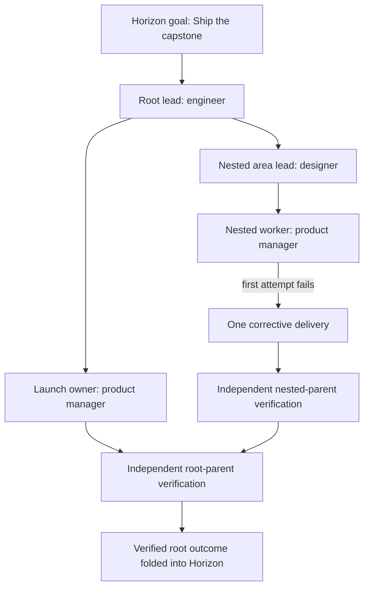

# M8 Capstone Test Report - Specialist-Led Delegation

_Acceptance completed 2026-07-13_

## Verdict

**PASS for the M8 acceptance surface.** The deterministic capstone completed a nested, specialist-led
delegation tree through the real Chorus scheduler, recovered from an injected delivery failure, refused
a forged management action, independently verified both delegated parents, archived both mission Teams,
and folded the root result into Horizon exactly once.

The broader validation matrix passed **7,063 M8 tests** across authority, Team policy, lifecycle,
adapters, governance, scheduler integration, schema parity, and architecture boundaries. Dream's M8
contract suite passed **16 tests**. Horizon's complete suite passed **167 tests with 1 skip**.

## Scenario

The goal was to ship one integrated outcome using a two-level delegation tree. No employee had the
profession `manager`.

| Participant | Profession | Responsibility |
|---|---|---|
| Root lead | Engineer | Own root decomposition, integration, and acceptance. |
| Nested lead | Designer | Own one explicitly granted delegated area. |
| Launch owner | Product manager | Deliver the launch plan. |
| Nested worker | Product manager | Deliver and correct the nested implementation. |
| Independent reviewer | Reviewer | Verify both delegated parents in distinct durable runs. |

The root profile allowed two levels of delegation and a Team of three. The nested profile allowed one
level and a Team of two. The nested task also carried an explicit subdelegation grant, proving that the
profile alone was insufficient.

## Adversarial actions

### Injected delivery failure

The first nested implementation attempt returned a failing outcome. Horizon immediately moved the goal
to `drifting`. The nested lead submitted exactly one replacement task, linked it to the rejected work,
and did not create a second correction on retry.

### Forged management call

Before each legal decomposition, the independent reviewer attempted the same operation while pretending
to act as the lead. The service rejected it because the actor was not the delegation contract lead. The
child count was zero before and after every attempt, proving refusal without partial writes.

### Idempotent retries

Each legal decomposition request was repeated with the same revision. Both calls returned identical
child identifiers. The finished ledger contained unique task IDs, one corrective task, and no task whose
parent was missing.

### Independent verification

Both delegation contracts required objective verification after lead acceptance. Each emitted one
passing `PARENT_VERIFIED` activity naming the reviewer. The corresponding reviewer runs:

- were owned by the reviewer rather than either lead;
- used distinct `rev_*` run identities;
- held durable leases and completion timestamps;
- were disjoint from the contracts' lead-acceptance run IDs.

This proves separate execution evidence, not merely a reviewer label attached to the lead's run.

## Lifecycle result

| Invariant | Observed result |
|---|---|
| Generic Manager profession absent | Every employee retained a specialist or reviewer profession. |
| Failure count | Exactly 1 injected child failure. |
| Corrective reaction | Exactly 1 correction by the nested lead. |
| Unauthorized writes | 0 children or membership changes from forged calls. |
| Delegation contracts | 2 created, 2 independently verified, 2 done. |
| Mission Teams | Root and nested Teams both archived after verified closure. |
| Duplicate tasks | 0; all task IDs unique. |
| Orphan tasks | 0; every non-root task referenced an existing parent. |
| Horizon after child failure | `drifting`. |
| Horizon after verified root | `done=True`, health `on_track`. |
| Verification ownership | 2 durable reviewer-owned runs, distinct from lead acceptance. |

## Crash and restart evidence

The acceptance suite separately exercised storage-backed restart boundaries with file-backed SQLite.

### Root intake race and cold reopen

Two independent connections were synchronized so both observed no existing Horizon root before trying
to create one. A partial unique index on the intake fingerprint selected one durable winner. Both
callers received the same root, Team, and lead. After closing and reopening the database, it contained:

| Durable object | Count |
|---|---:|
| Root task | 1 |
| Mission Team | 1 |
| Delegation contract | 1 |
| Lead membership | 1 |
| Lead wake | 1 |
| Contract creation audit | 1 |

### Decomposition crash after claim open

The process failed after opening the exact-once claim but before creating a child. A cold reopen reused
the original claim, created the two intended children, added the one gating dependency, completed the
claim, and emitted one `DECOMPOSED` activity.

### Decomposition crash after first child write

The process failed after persisting the first child but before adding its parent gate. A cold reopen
reused that child, created only the missing child, repaired the missing dependency, completed the same
claim, and again left one `DECOMPOSED` activity.

These are real close/reopen tests, not retries against an in-memory object.

## Security and architecture gates

The acceptance matrix checked both authorization layers:

- unauthorized management tools are absent from delivery harnesses;
- stale, unprofiled, wrong-actor, out-of-line, and over-limit calls are rejected again by the service;
- active contracts block authority-reducing reorganizations;
- authority intersection never exceeds any input grant;
- integration exhaustion escalates rather than force-accepting;
- migration and authority mutations are audited transactionally.

An AST architecture gate scanned Chorus and Horizon production modules in both directions. All **376
parameterized checks** passed, enforcing that shared types come from Dream and neither production tree
imports its sibling.

## Validation record

| Scope | Result |
|---|---|
| Chorus M8 acceptance matrix | **7,063 passed** |
| Dream M8 contract tests | **16 passed** |
| Horizon complete pytest suite | **167 passed, 1 skipped** |
| Chorus Ruff | **passed** |
| Horizon Ruff | **passed** |
| Dream Ruff | **passed** |
| Chorus strict mypy | **passed** |
| Horizon strict mypy | **passed** |
| Architecture boundary gate | **376 passed**; included in the Chorus M8 count |

## Broader-suite disclosure

The complete Chorus repository suite was also started with the correct Dream and Horizon source roots.
Its first deterministic baseline failure occurred after **116 passes** in
`tests/cli/test_beat_surfaces.py::test_empty_surfaces_env_keeps_engineer_default`: the legacy assertion
expected no default engineer skills, while the current baseline supplies `cross-beat-resume` and
`cross-beat-recall`. This test is outside M8 and was not changed.

The complete Dream suite has pre-existing Windows/POSIX and environment/stub findings outside the M8
contract surface. Dream strict mypy reports **14 unrelated environment/platform/stub findings**. These
were not hidden and did not justify unrelated production edits.

The Unit Test MCP runner could not select the repository virtual environment or configure the sibling
source roots. Tests were generated through the required workflow, while authoritative execution used
the Chorus Python 3.11 virtual environment with explicit source roots.

## Conclusion

M8 meets its acceptance contract under normal, adversarial, concurrent, and cold-restart conditions.
The system preserves specialist identity, delegates only through explicit bounded authority, recovers
without duplicate organizational or task state, requires independently evidenced parent verification,
and reports one authoritative strategic outcome back to Horizon.

The remaining red baseline checks are disclosed above and are not M8 regressions. No commits were made.
