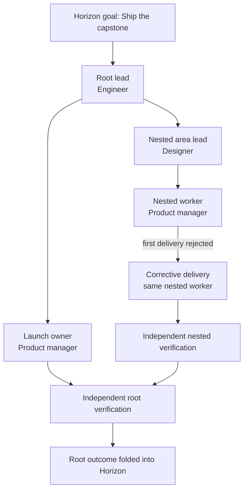
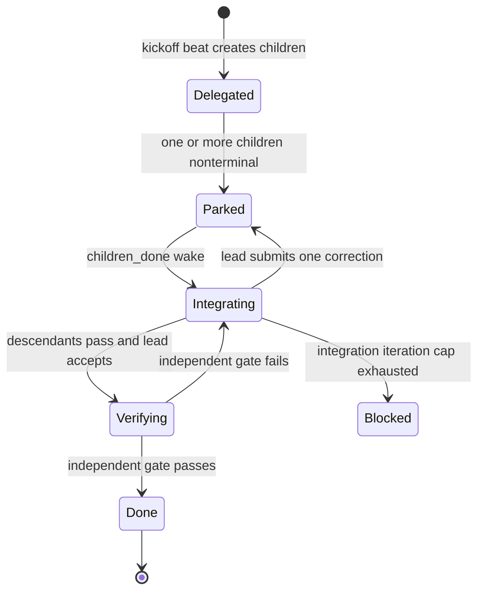

# M8 Operational Decision Report - How the Delegated Company Ran

_Generated 2026-07-14 from the deterministic M8 capstone and the production M8 control paths_

## Executive answer

The capstone proved that a specialist-led company can turn one strategic goal into nested Team work,
route each task to an authorized employee, react to a failed delivery, collect durable child evidence,
and close the goal only after lead acceptance and independent verification.

The most important architectural fact is that no single agent controlled the entire process:

| Decision | Owner |
|---|---|
| What outcome the company wanted | Horizon strategy record / operator-seeded capstone goal |
| Who was legally allowed to lead | Human-granted management profiles plus Chorus policy |
| Who led this capstone root | Pre-seeded test setup |
| Who would lead a normal delegated intake | Chorus `LeadSelector` |
| How the work was decomposed | Delegation-mode specialist lead |
| Whether an assignee was legal | Chorus authority and Team policy |
| When an employee ran | Durable wakes plus the Chorus scheduler |
| Whether a child deliverable passed | Child Definition of Done and run verdict |
| How a failed child was corrected | Nested lead, within one bounded integration reaction |
| Whether the combined parent was acceptable | Lead acceptance plus independent reviewer gate |
| Whether the strategic goal was done | Horizon root-authoritative outcome fold |

## Scope disclosure

This was a **deterministic real-scheduler capstone**, not a provider-backed live LLM run. The production
Chorus scheduler, ledger, authority services, task lifecycle, Teams, contracts, wakes, and Horizon fold
were exercised. A controlled runner supplied repeatable employee decisions so failure, correction,
authorization, and completion could be asserted exactly.

The capstone also did **not hire new employees**. It seeded a known company and exercised staffing,
delegation, and execution. Production M8 selects among existing employees; autonomous recruiting and
employee creation are outside this milestone.

## Company topology

No employee had the profession `manager`. The word "manager" below means a specialist acting as the
accountable lead of a delegation-mode task.

| Employee | Profession | Reporting line | Management authority | Capstone responsibility |
|---|---|---|---|---|
| `root-lead` | Engineer | Top-level | Lead and subdelegate; depth 2; Team size 3; designer/PM scope | Own the root outcome and root mission Team. |
| `nested-lead` | Designer | Reports to root lead | Lead and subdelegate; depth 1; Team size 2; PM scope | Own the nested implementation area. |
| `launch-owner` | Product manager | Reports to root lead | None required | Deliver the launch plan. |
| `nested-worker` | Product manager | Reports to nested lead | None required | Deliver and correct the nested implementation. |
| `reviewer` | Reviewer | Independent | Read-only verification role | Verify both delegated parents. |

## Hiring and staffing decision

### What happened in the capstone

The test setup created the five employees, reporting lines, two management profiles, root Team, root
task, and root delegation contract. It explicitly assigned `root-lead`. Therefore the capstone proved
that a chosen, authorized lead could operate the lifecycle; it did not prove a model made a hiring
decision or that the production lead selector chose this particular person.

### How normal delegated intake decides

For a real Horizon team-shaped request, Chorus considers only existing employees who satisfy all of the
following:

1. They are invokable and not blocked by status or reporting-line health.
2. They have an active management profile with `can_lead=True`.
3. Their profile can accommodate the requested Team size and spend ceiling.
4. Their direct reports cover every requested profession and count.
5. Their profile allows those professions.
6. Their current budget permits another invocation.

A valid user-provided preferred lead wins. Otherwise Chorus ranks eligible candidates by:

| Rank input | Preference |
|---|---|
| Lead's own profession fit | Better fit first |
| Required direct-report coverage | More coverage first |
| Existing nonterminal task load | Lower load first |
| Budget headroom | Greater headroom first |
| Employee ID | Stable deterministic tie-break |

If no candidate qualifies, intake returns a typed `staffing_blocked` result and creates no root task,
Team, wake, or partial assignment. M8 does not quietly hire, invent an employee, or leave an unassigned
task waiting forever.

## Root work creation

In production, Horizon sends intent, goal ID, priority, staffing requirements, optional preferred lead,
Team-size limit, spend limit, and an idempotency fingerprint. It does not name child employees or build
a task graph.

After lead selection, Chorus atomically creates or recovers:

- one delegation-mode root task;
- one active mission Team;
- one lead membership;
- one delegation contract with pinned authority limits;
- one assignment to the lead;
- one durable `task_assigned` wake;
- corresponding audit activity.

Concurrent retries use the Horizon fingerprint as a storage-enforced exact-once key. Both callers see
the same root, Team, and lead.

## How tasks were delegated to employees

### Root lead decision

On the root kickoff beat, the controlled lead proposed two children:

| Child | Mode | Assignee | Why it was legal |
|---|---|---|---|
| `nested-area` | Delegation | `nested-lead` | Direct report; designer allowed; active profile; root contract allowed subdelegation; child carried explicit subdelegation grant. |
| `launch-plan` | Delivery | `launch-owner` | Direct report; PM allowed; inside Team-size and depth limits. |

### Nested lead decision

On its kickoff beat, `nested-lead` proposed one delivery child:

| Child | Mode | Assignee | Why it was legal |
|---|---|---|---|
| `nested-implementation` | Delivery | `nested-worker` | Direct report of nested lead; PM allowed by nested profile; inside inherited limits. |

### Chorus validation

The lead proposed the work shape, but Chorus decided whether it could be written. Before any child was
created, Chorus checked:

- caller is the delegation contract lead;
- task is in the `delegated` kickoff phase;
- active profile version matches the pinned contract;
- target is a legal direct report;
- Team membership does not widen the reporting line;
- profession, depth, Team-size, spend, parent grant, and task grant all intersect;
- nested delegation has both a compatible profile and explicit child grant;
- reviewer is not assigned delivery work;
- all sibling dependency labels resolve.

The wave was transactional. A bad assignee or unauthorized child would refuse the entire wave, not
create the valid subset. The legal wave added Team memberships, deterministic children, assignments,
dependency gates, `task_assigned` wakes, nested Team/contract state, and audit records.

The capstone retried each decomposition with the same run revision. Both calls returned the same child
IDs and created no duplicates.

## How beating was handled

A **beat** was one short execution attempt by one employee against one task. Beats were driven by
durable ledger wakes rather than direct agent-to-agent calls.

### Wake types used by this flow

| Wake | Produced when | Effect |
|---|---|---|
| `task_assigned` | A task and assignee are committed | Makes the employee's task eligible for a beat. |
| `deps_resolved` | A completed task releases a dependent | Makes newly unblocked work eligible. |
| `children_done` | The last child of a parent becomes terminal | Makes the parent eligible for reaction or integration. |
| `recovery` | A bounded repair or operational recovery is needed | Re-enters work without losing ownership or evidence. |

Assignment and its wake committed in one transaction. Likewise, a successful child verdict, the
child's `done` state, and downstream wakes committed together. A crash therefore could not leave an
assignment without a wake or a completed child without its parent notification.

### Scheduler gates

For each pulse, the scheduler claimed only available wakes and then checked:

1. Organization-wide concurrency budget.
2. At most one live beat per employee.
3. Task dependency readiness.
4. Stale or already-terminal wakes.
5. Employee invokability and legacy-Manager migration state.
6. Budget gates.
7. Atomic checkout so only one run owns the task.

The capstone configured `max_concurrent_runs=1`. Employee beats therefore ran serially, which made the
causal sequence deterministic. Production may run multiple employees concurrently while retaining
per-employee serialization and atomic task checkout.

Each run had a durable run ID, status, start/finish timestamps, lease, task identity, employee identity,
and outcome. Wakes were marked done only after run lifecycle handling completed.

## Beat-by-beat operational trace

The exact generated IDs vary, but the control sequence was:

| Phase | Employee | Trigger | Decision or work | Durable result |
|---:|---|---|---|---|
| 1 | Root lead | Root `task_assigned` | Decompose root into nested area and launch plan. | Root children, Team membership, nested Team/contract, child wakes; root parks. |
| 2 | Nested lead | Nested-area `task_assigned` | Decompose area into nested implementation. | Nested child and wake; nested parent parks. |
| 3 | Launch owner | Launch-plan `task_assigned` | Deliver launch plan. | Delivery passes and task becomes `done`. |
| 4 | Nested worker | Implementation `task_assigned` | First implementation attempt. | Injected failure; task becomes terminal `rejected`; Horizon health becomes `drifting`. |
| 5 | Nested lead | `children_done` after rejected child | Inspect evidence and submit one replacement child. | Exactly one `nested-correction` task and wake; nested parent parks again. |
| 6 | Nested worker | Correction `task_assigned` | Deliver corrected implementation. | Correction becomes `done`; nested lead receives `children_done`. |
| 7 | Nested lead | `children_done` | Integrate and accept corrected nested subtree. | Lead acceptance, independent reviewer run, nested contract `done`, nested Team archived. |
| 8 | Root lead | Root subtree becomes terminal | Integrate nested outcome with launch plan and accept root. | Lead acceptance and independent root reviewer run. |
| 9 | Reviewer | Kernel-created verification runs | Read-only verification of nested and root objectives. | Two distinct passing `rev_*` runs and `PARENT_VERIFIED` activities. |
| 10 | Horizon | Passing root outcome | Fold authoritative root result. | Goal `done=True`, health `on_track`. |

The table is a logical causal ordering. The reviewer verification runs are created inside their
respective parent-finalization phases rather than by ordinary assignment wakes.

## How the lead collected information from employees

The leads did not depend on employees remembering to send chat summaries. Child work became durable
ledger evidence. Before an integration beat, Chorus built `.harness/integrate-context.json` in the
lead's working directory.

For every direct child, that packet contained:

- task ID, label, intent, assignee, and assignee profession;
- task status and unresolved blockers;
- Definition-of-Done status and verdict;
- latest run ID, run status, summary, and structured outcome;
- landed artifact type and reference.

It also contained:

- parent intent and integration iteration number;
- `accept` or `react` kernel recommendation;
- legal direct reports and their current status;
- Team and delegation-contract state;
- current delegation depth and effective limits;
- nested subtree summaries with lead, Team, contract, child count, and terminal count.

This is the management information boundary: employees produce task/run/DoD/artifact records; Chorus
projects those records into one read packet; the lead decides whether to accept or make one bounded
correction. The lead does not inspect another employee's private model context and does not rely on an
ephemeral conversation transcript.

The packet creation itself emits a `SCRUM_PACKET` activity with child counts, completed/blocked counts,
and direct-report IDs for auditability.

## Was a lead beat triggered when all child tasks completed?

**Yes, with an important qualification.**

When the last child became terminal, Chorus atomically enqueued a `children_done` wake for the parent's
assignee. The scheduler treated a parent with a wholly terminal subtree as ready to integrate even when
a rejected child still appeared as an unresolved parent gate. This allowed the lead to react to failure
instead of waiting forever.

`children_done` did **not** mean "mark the parent done." It meant "the lead now has a complete snapshot
and must react or integrate."

In this capstone, the first nested `children_done` wake arrived after the only child was rejected. The
nested lead reacted with one correction. A later `children_done` wake arrived after that correction
passed, allowing integration and verification. Root integration became eligible only after both its
required branches were terminal and passing.

## How failure was handled

The first nested implementation was deliberately failed. The effects were:

1. The child run recorded a failing result.
2. The child became `rejected`, which is terminal but not successful.
3. Horizon folded the child outcome and changed goal health to `drifting`.
4. Because the nested subtree was terminal, Chorus woke the nested lead with `children_done`.
5. The lead saw the rejected child in the integration packet.
6. The lead submitted one exact-once correction naming the rejected task as its replacement.
7. Chorus removed the failed task's parent gate and added the correction as the new gate.
8. The correction passed and woke the lead again.

Corrective `submit_one` and `reassign` operations are legal only while the contract is `integrating`.
They run through the same authority checks as kickoff decomposition. A lead cannot use the correction
phase to reach outside its line or widen its contract.

If a delegated lead repeatedly reacts without producing an acceptable result, the integration-iteration
cap blocks the task and contract and opens a human recovery action. Delegation mode never force-accepts
at the cap.

## Unauthorized-action test

Before each legal decomposition, the reviewer attempted the same call as a forged lead. Chorus refused
it with `actor is not the delegation contract lead`.

The child count was zero before and after each forged attempt. This demonstrated both authorization
layers:

- the runtime normally does not expose management tools to the reviewer;
- the service still refuses the forged call if invoked directly.

No task was ever assigned to the reviewer as delivery work.

## How the parent task ended

A delegated parent could end successfully only after all of these gates passed:

| Gate | Evidence |
|---|---|
| Required descendants | Every current parent dependency gate referenced a `done` task. |
| Lead integration | Lead beat inspected the assembled subtree and returned a passing result. |
| Lead acceptance | Contract recorded the lead's accepted run and a `LEAD_ACCEPTED` activity. |
| Objective floor | Parent verifier did not reject the integrated workspace. |
| Independent review | A non-author reviewer ran the objective under a distinct durable `rev_*` run. |
| Outcome landing | Parent subtree outcome landed before final task completion. |
| Contract closure | Contract transitioned from `verifying` to `done`. |
| Team closure | Mission Team archived atomically with verified contract closure. |

The independent reviewer was selected as the first invokable reviewer who was not the lead. Each of the
two parent contracts received a separate reviewer-owned run with a lease and finish timestamp. Reviewer
run IDs were disjoint from lead-acceptance run IDs.

If independent verification had failed, Chorus would have returned the contract to `integrating`,
recorded a failed `PARENT_VERIFIED` activity, blocked the task, and enqueued another `children_done` wake
for the lead. A failed reviewer could not silently close the parent.

After the verified root landed, Chorus marked the root task `done`, closed its delegation contract, and
archived its mission Team. Horizon then accepted the passing `is_root_outcome=True` event as
authoritative for the goal and changed the strategy record from `drifting` to `done` / `on_track`.

## Why child events could not finish the strategic goal

Horizon tracked child outcomes for health and diagnosis, but a child pass was not equivalent to goal
completion. Only a passing root-subtree outcome could mark the goal done. Event IDs and task revisions
made folding replay-safe and monotonic, so duplicate, stale, or out-of-order events could not reverse a
newer authoritative result.

This ownership split prevented two common errors:

- one successful employee task claiming the whole goal was complete;
- a late failed child event overriding a root result that had already integrated and verified the final
  corrected subtree.

## Durable records available for audit

The completed run left inspectable records for:

- employees, professions, and reporting lines;
- management profile grants and versions;
- root and nested mission Teams and memberships;
- root and nested delegation contracts;
- task hierarchy, dependencies, assignments, and replacements;
- run identities, leases, outcomes, and completion times;
- Definitions of Done and verdicts;
- assignment, decomposition, acceptance, verification, and Team lifecycle activities;
- Horizon task-outcome map, goal health, and authoritative root completion.

The capstone asserted two contracts completed, two Teams archived, one injected failure occurred, one
correction was created, all task IDs were unique, every non-root task had an existing parent, and no
unauthorized mutation landed.

## Architectural questions and answers

### Who decides strategy versus execution shape?

Horizon decides that a goal needs team-shaped execution and supplies staffing requirements. The lead
decides the child graph. Chorus validates and persists it. Horizon does not schedule named employees or
invent child tasks.

### Who owns hierarchy?

Humans govern `reports_to` and management profiles. Chorus may form temporary mission Teams but cannot
use Team membership to alter or bypass the reporting line.

### Can authority expand during nested delegation?

No. Nested authority is the intersection of global policy, profile, line scope, Team membership, parent
contract, and child contract. Every nested limit is equal to or narrower than its parent inputs.

### Can a lead perform craft work inside the parent?

No. Delegation-mode execution receives a sealed management surface. The same engineer or designer may
perform craft work on a separate delivery-mode task, but not hide delivery work inside the coordination
parent.

### How is capacity handled?

The scheduler uses existing task/run/wake state, per-employee serialization, organization concurrency,
and budget gates. M8 observes these facts for lead selection and Horizon effective priority; it does not
introduce a second reservation scheduler.

### What survives a crash?

Assignments, wakes, claims, children, dependencies, runs, contracts, Teams, and audit events are durable.
Separate file-backed tests closed and reopened SQLite after claim-open and first-child-write failures,
then resumed the same claim without duplicate children or audit events.

### What prevents duplicate intake?

The Horizon origin fingerprint has a partial unique index in Chorus storage. A concurrent loser rolls
back and reads the winner, returning the same root, Team, and lead.

### What happens if no independent reviewer exists?

The parent cannot pass verification. The scheduler returns a failed verification result rather than
self-approving through the lead.

### What happens if the org changes during active work?

Reporting changes, profile weakening/deactivation, termination, or legacy specialization that would
invalidate an active contract fail closed with an active-delegation conflict. The original contract
remains replayable under its pinned authority version.

## What this capstone proved and did not prove

### Proved

- Real scheduler and durable-wake orchestration across a nested specialist hierarchy.
- Exact-once decomposition and idempotent retry behavior.
- Direct-report, Team, profile, contract, phase, and actor authorization.
- Failure-to-reaction-to-correction lifecycle.
- Lead information projection from durable child evidence.
- `children_done` integration wakes for failed and successful terminal subtrees.
- Separate lead acceptance and reviewer-owned parent verification.
- Root-authoritative Horizon completion.
- No duplicate tasks, orphan tasks, unauthorized writes, or unarchived completed Teams.

### Not proved by this test alone

- Autonomous recruiting or employee creation.
- Production `LeadSelector` choosing the seeded root lead; that policy has separate tests.
- Model quality or reliability under a live provider.
- Parallel capstone execution; concurrency was intentionally set to one.
- Cross-line staffing, matrix management, or standing Team reuse, which are out of M8 scope.

## Final outcome

| Measure | Result |
|---|---|
| Generic Manager employees | 0 |
| Delegation levels | 2 |
| Delegation contracts | 2 done |
| Mission Teams | 2 archived |
| Injected delivery failures | 1 |
| Corrective tasks | 1 |
| Forged decomposition writes | 0 |
| Duplicate task IDs | 0 |
| Orphan tasks | 0 |
| Independent parent verification runs | 2 passed |
| Intermediate Horizon health | `drifting` |
| Final Horizon state | `done=True`, health `on_track` |

The task ended because the corrected execution tree was complete, both specialist leads accepted their
integrated scopes, two independent reviewer runs passed, Chorus landed and closed the root subtree, and
Horizon received the one root-authoritative completion event. Child completion triggered the opportunity
to integrate; it never bypassed the management and verification decisions required to finish.
